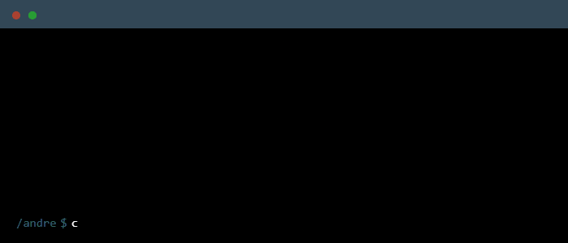

<!--
Hello, I'm Andre. Thanks for exploring my README!
-->

<!--
Header wave
-->

<!--
Typing SVG
-->

<!--
Terminal GIF
-->

<!--
About Me
-->
### About Me
I’ve always liked building things from scratch, especially anything involving technology.
I’m building AI and traditional projects with a focus on real-world impact and scalability.

### Main Skills

### Learning

